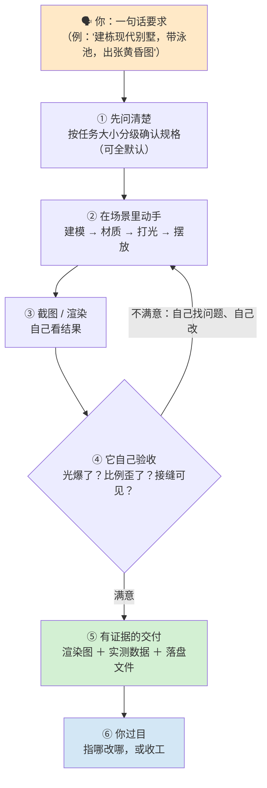
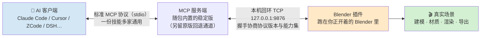

# blender-mcp skill

**让 AI 直接坐在你的 Blender 里干活：你说要什么，它动手做完，还会自己回头看一眼成果——不满意就继续改，最后带着图和证据交给你。**

适用任何支持 Agent Skills 的 AI 助手（Claude Code / Cursor / ZCode / Codex / DeepSeek Harness…）。
你不需要懂代码、不需要学 Blender：**在聊天里把要求说清楚就行**，双手不用离开键盘。



---

## 它是什么

想让 AI 帮你操作 Blender，直接扔一句"帮我建个房子"给普通 AI，通常会撞上三个死结：

1. **AI 看不见画面**——它只能凭空想象参数，光照爆了、比例歪了、贴图接缝露着，它统统不知道；
2. **干完一句话"好了"**——你既不知道它动了什么，也不知道它有没有碰坏你原来的场景；
3. **聊天记录不是本事**——这次碰巧做对了，下次换个任务就露馅，经验不沉淀、错误照犯。

这个技能包就是为这三件事造的。整个思路一句话：

> **不让 AI 凭空想象画面——让它每一步都"看得见、作得准、可回退、要交证据"。**

具体做法：

- 每个任务开头先**看**：截图读场景、读你的参考图，把目标"长什么样"先描述给你确认；
- 改完立刻**看**：截图或渲染后真的读图再判断，发现问题自己定位、自己改，直到看着对；
- 做事有**规矩**：只动它自己创建的物体（带固定前缀），你原有的相机、灯光、World、模型一律不碰；批量操作先存快照，随时可回退；
- 交付有**证据**：给的是渲染图 + 实测数据（面数/尺寸/文件清单）+ 你能直接打开的文件——而不是"已完成"三个字；
- 拿不准就**问**：规格模糊、风格不确定、代价大的操作，问清楚再动手。

## 效果长这样

下面是 Blender 里能跑出的画面（本机过往渲染输出，缩略图）：

| 鸟瞰全景 | 近景细节 |
|---|---|
|  |  |

一栋完整的两层住宅：建筑体块、玻璃幕墙、泳池水面、室内家具、庭园绿化、灯光氛围——
这类"从零到成品图"的任务，正是在对话中一步步完成的典型场景。

---

## 特点（为什么值得用）

- **它真的会"看"自己的作品。** 不是调完参数就交差：出图后它读那张图——高光爆没爆、形体歪没歪、接缝露没露——看得见问题，然后自己修。这是它和"提示词合集"最大的区别。
- **动手前先问清楚。** 一句话需求不会闷头乱做：小任务问一两句、大任务多确认几轮，全部带默认值（你不回答它就按推荐走），确认过规格再开工——比返工便宜一个量级。
- **"完成"必须有证据。** 每单交付物固定三件套：成品图 + 实测数据（面数、尺寸、文件大小）+ 可打开的文件。说得出口的每个结论都有可检查的依据。
- **绝不碰你的场景。** 在你自己开着的 Blender 里干活，纪律是只动它自己带前缀的物体；你的相机、灯光、环境、模型、材质一律不碰；批量操作前先存快照，出问题一键回退；事后的清理也只清自己建的。
- **失败了不会把你带沟里。** 改崩了能回退（快照先行）；脚本必须"跑两遍结果一样"（幂等），不怕重复执行；大工程拆成小步，每步都可检查。
- **断网也能装。** 插件和服务端完整内置在仓库里（`assets/` 下两套离线包 + 校验和），不需要去外部商店现下；也就不会出现"上游更新了、你这边突然坏掉"。
- **一份技能，多家 AI 通用。** Claude Code、Cursor、ZCode、Codex、DeepSeek Harness 等主流客户端都能装，放对目录即可（`INSTALL.md` 里有一张对照表）。
- **它带的是一本 14 分册的实战手册，不是一段提示词。** 建模流程、材质配方、灯光参数、几何节点写法、动画物理、批量参数化、报错排查、无头 CI——每一条经验都标注了"真机实测过"还是"查资料得来"，还写清了踩过的坑（有些坑能让一整套工作白做，手册里就是一道道防它重演的检查点）。
- **自带积木库，越用越省。** 常用装置（三点布光、场景体检、渲染回读）都有现成脚本；做过的节点组会存起来，下次直接拿。
- **能连五大免费模型库。** PolyHaven / Poly Pizza / Sketchfab / Rodin / Hunyuan3D——找沙发、找树、找 HDRI、甚至用文字生成一个模型，它都会；并且**选素材会先看外观再挑**，不是看名字瞎选。
- **服务器上也能跑。** 批量转换、每天定时渲染、CI 流水线——不开界面（无头模式）命令行直接跑。
- **安全是默认设置。** 代码执行默认过白名单筛查（禁文件/网络/系统操作）、连接只绑本机（不对局域网暴露）、遥测可一键关掉、一切改动有备份。
- **这个包是被"挑刺"挑出来的。** 它交给独立的检查方审了 **60 多轮**：从"手册里这句话和实际行为对不上"这种细节开始查，被挑出并修掉的问题 **160 多个**，每个都有记录、有去向、能翻回原文核实。仓库里自带体检命令——**你不用相信任何口头保证，一条命令就能自己验证手里的包是不是完好的**。

## 技术特点（给想看底层的人）

上面讲的是"对你有什么用"；这一节讲**它凭什么做到**。每条都能在包内找到对应实现（`references/` 手册与 `evals/` 自检工具里）。



**1. 三层解耦的通信架构**——AI 客户端 ↔ 服务端走标准协议（所以换 AI 客户端不用改任何东西）；服务端 ↔ Blender 走本机回环 TCP（默认不对局域网暴露）；连接时**握手协商协议版本与能力集**（当前协议 7、自报 11 项能力），版本不匹配会明确报出原因而不是神秘失败。服务端**内置在包里**随包发版——升不升级你说了算，不由上游说了算。

**2. 执行安全沙箱**——"让 AI 在 Blender 里跑代码"听着吓人，所以每个脚本先过 **AST 白名单审查**：文件系统、网络、子进程、反射、动态属性、裸迭代器一概禁止，只放行 Blender 自己的 API 加 27 个安全标准库。关键设计是**整脚本闸门**：一处违禁，整个脚本零执行——不会出现"跑到一半把场景弄脏"的半成品状态；拒绝是秒回的、带行号的，AI 按行号改完再来。

**3. 画面怎么送进 AI 的眼睛**——视口截图与渲染出的图都以**图像数据直传**（原生多模态，不是"给一个路径让 AI 自己想象"）。两个工程细节：**固化视角**——截图前由代码先锁定相机，不跟着你的鼠标乱跑（否则它看到的和你要的不是同一个画面）；**落盘回读双保险**——渲染图写完还要读回来核对（尺寸/字节数对不上直接报错），杜绝"以为出图了其实没出"。门也分两类：构图类问题靠**看图**判定（目验门），几何/导出类靠**实测数据**判定（机验门）——各用各的强项。

**4. 状态一致性设计**——为什么敢在你正在干活的工程文件里跑：只动固定前缀的物体（你的相机/灯光/世界/模型一律不碰）；批量操作前先存**快照**，随时可回退；导入失败回滚用**身份差集**（导入前后物体 ID 集合之差），不用名字匹配（名字会撞车，ID 不会）；每个程序化操作后做**退化清理**（不做的话模型会悄悄变脏，面数反涨）；脚本要求"跑两遍结果一样"（幂等），重复执行不会翻倍。

**5. 可验证性工程（这个项目的看家本领）**——手册里每一条关键承诺，都配了一个自动化检查：

- **86 条规则回归**：改坏任何一条，发布前立刻报警（条款级回归测试，不是抽查）；
- **发布四道机器门**：规则回归 → 版本三处对齐 → 五个安装位置逐字节比对 → 记录账前后一致，缺一道不发版；
- **对检查器本身的破坏测试**（反向探针）：故意改坏规则、删记录行、塞"永远成立"的假条件——检查器必须报警，不报警算自检失败。这是"对验收测试的验收"，也是这个包 60 多轮外部审计能查出 160 多个问题的底气所在。

**6. 无头与规模化**——两条离屏路线：Blender 命令行 与 bpy wheel 常驻进程（后者免去每步冷启动开销），服务器/CI 上跑批量任务不需要开界面。参数化生成器带固定随机种子与参数钳制——同一份配置，到哪台机器跑出来都一样。

**7. 把环境差异写进手册**——Blender 5.2 的 API 变化（哪些函数没了、哪些参数改了）、中文界面的本地化陷阱（节点名被翻译，必须按类型查找）、glTF 导出会静默丢几何（所以导出必须回读验证）、30 秒调用超时下的任务切分纪律……每条都标注"真机实测"还是"资料查证"，不掺水。

## 它怎么工作（对照最上面那张图）

1. **先问清楚**——你说一句"建个现代别墅"，它先反问：多大？几层？要不要泳池？什么氛围？（小任务自动跳过，直接用默认值。）
2. **动手**——在场景里从体块开始：先搭大形，确认轮廓对了再加细节；材质按"先看参考、再配参数、试渲验证"走；灯光按需布点，氛围边调边看。
3. **看图验收**——每个阶段结束都截图或渲染，它读图判断：形体准不准、材质对不对、打光好不好。不通过就回到第 2 步继续改。
4. **定稿交付**——最终渲染 + 实测数据 + 文件清单 + 三言两语的"我改了什么、哪里妥协了"。有参考图的任务会**做对照展示**（参考 vs 成品）。
5. **你过目**——不满意直接说（"左边那棵树太大"），它按你的意见继续改；满意就收工。

## 你要做的（三步）

```bash
# 第 1 步 · 装技能：把本仓库文件夹复制到你 AI 客户端的技能目录
cp -r blender-mcp-skill ~/.zcode/skills/blender-mcp     # 客户端的对应路径见 INSTALL.md

# 第 2 步 · 装 Blender 插件（一次性）：
#   Blender → 编辑 → 偏好设置 → 插件 → 从磁盘安装
#   → 选 assets/brickfly-mcp-bundle/brickfly_mcp.py → 启用
#   然后在 3D 视图按 N 打开侧栏 → "Brickfly MCP for Blender" → Start MCP Server

# 第 3 步 · 把服务端接进 AI 客户端（一次性，配置示例见 INSTALL.md，Windows 有现成命令）
```

装完之后就是纯聊天：**"帮我把这个模型减到两万面"、"给整个场景打黄昏光出图"、"导出 glb 给我"**——它在你看得见的地方一件件做完。

## 交付物长什么样

| 你要的任务 | 你会拿到 |
|---|---|
| 建模 / 场景搭建 | 成品渲染图 + 物体清单 + 面数统计（尺寸按需给） |
| 材质 / 贴图 | 效果图 + 用了哪些材质、参数是多少 |
| 打光 / 渲染出图 | 成图 + 相机/灯光配置说明（想复现同一张图随时可以） |
| 减面 / 清理 / 体检 | 前后对比数据（面数、文件大小、问题清单） |
| 导出交付（glb/fbx） | 文件 + **回读校验报告**（确认没丢东西，防止格式坑） |
| 批量 / 定时任务 | 处理日志 + 成品文件列表 + 失败清单（带原因） |

## 靠谱吗

- **被独立审计打磨过**：60 多轮外部检查、160 多个问题全部闭环（含"手册说法与实测不符"这类最隐蔽的问题）；
- **每次发版自动体检**：86 条关键规则逐条回归、版本号三处对齐、安装包在 5 个位置逐字节比对、全套检查没过不发版；
- **仓库自带验证命令**：你拿到包后一条命令就能复验上面这些（`INSTALL.md` 有说明），不用信任何自述；
- **默认通道自主可控**：内置的服务端是随包维护的稳定版（不追外部最新），另有原版回退通道，随时可切换；
- **安全姿态保守**：白名单执行 + 本机回环 + 遥测可关 + 快照可回滚；
- **实战检验**：本机日常任务（建模/改材质/批量导出/出图）持续在跑，手册里的坑都是真踩过之后写进去的。

## 常见问题

**会弄乱我正在做的场景吗？** 不会。它只动自己创建的物体（固定前缀），你的东西一律不碰；批量操作前自动存快照。
**必须联网吗？** 不必。安装、建模、材质、渲染全部本地可用；只有"下载素材库模型"这类功能需要网络。
**要什么版本？** Blender 5.2 LTS 最佳（4.x/5.x 大多兼容，差异处手册里都标注了）。中英文界面都行（中文界面的坑已专门处理）。
**我完全不懂 Blender 能用吗？** 能。你把要求说清楚就行；它甚至会替你做基本的美术决策并解释理由。

## 包里有什么

| 目录 | 用途 |
|---|---|
| `SKILL.md` | 入口手册：开工自检、七条铁律、按需求查分册的路由表、卡死恢复流程 |
| `INSTALL.md` | 三步安装 + 多客户端路径表 + 离线安装 + 升级回滚 + 疑难解答 |
| `references/00~14` | **14 分册实战手册**：需求澄清 / 场景 / 材质 / 灯光渲染 / 动画物理 / 几何节点 / 资产库与导入导出 / 网格体检 / 参数化 / 安全与报错 / 无头 CI / 部署与安全 / 执行契约 / 建模工艺 / 视觉工作流 |
| `scripts/` | 现成骨架：建模五段式模板、场景体检、三点布光、渲染出图回读 |
| `fragments/` `nodes/` | 代码积木库与节点组库（拿来即用、越攒越多） |
| `assets/` | 离线安装包（插件 + 服务端 + 校验和 + 来源说明） |
| `evals/` | 体检工具：一条命令验证包完整性 + 关键规则回归 |
| `docs/` | 设计文档与实战案例 |
| `showcase/` | 门面展示图（目录层资产，不属于技能包本体） |

## 环境与许可

- Blender **5.2 LTS**（推荐）；Windows / macOS / Linux；中英文界面
- 内置的 Blender 插件与服务端来自开源项目 **MCP for Blender**（作者 Siddharth Ahuja，MIT 许可；来源、署名与改写说明见 `assets/*/ATTRIBUTION.md`）
- 本技能包（手册、脚本、积木库）：作者 misdeep，复制分发即用
