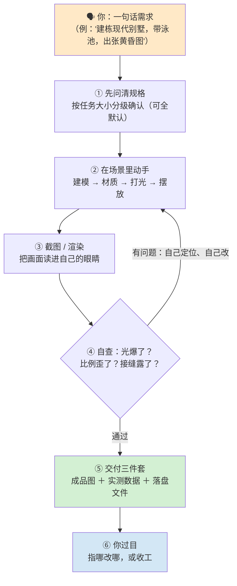
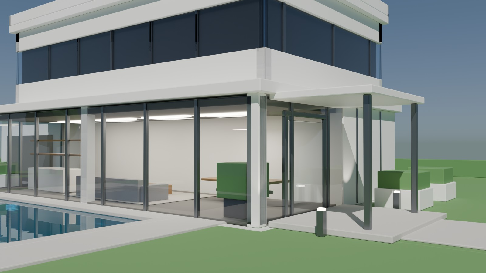
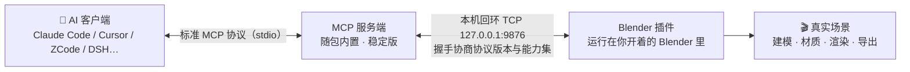

# blender-mcp-skill

[](https://github.com/master666-max/blender-mcp-skill/releases)
[](#许可与出处)
[](https://www.blender.org)
[](#上手三步)
[](#上手三步)
[](#凭什么信它)

**让 AI 助手接管一台真实运行中的 Blender：你提要求，它建模、配材质、打灯、出图、导出——每一步它都亲眼看着画面做判断，交付时附成品图与实测数据。**

> 📖 本 README 写给人类；AI 助手加载的是 [`SKILL.md`](SKILL.md)（Agent Skills 开放标准入口）。两份文档各司其职。

**目录**：[它解决什么问题](#它解决什么问题) · [效果长这样](#效果长这样) · [它有什么不一样](#它有什么不一样) · [技术内幕](#技术内幕) · [一个任务从头到尾](#一个任务从头到尾) · [上手三步](#上手三步) · [你会拿到什么](#你会拿到什么) · [凭什么信它](#凭什么信它) · [踩过的坑](#踩过的坑) · [常见问题](#常见问题) · [包里有什么](#包里有什么) · [许可与出处](#许可与出处)



## 它解决什么问题

直接把"帮我建栋房子"扔给 AI，几乎必然撞上三堵墙：

1. **AI 看不见画面。** 它只能盲调参数——光照过曝、比例失调、贴图接缝穿帮，它一概不知，还会自信地宣布完成。
2. **你不知道它干了什么。** 改完只回一句"好了"：动了哪些物体？碰没碰你原来的场景？删的东西还能回来吗？全都无从对证。
3. **聊天记录不是能力。** 这次碰巧做对了，换个任务、换个会话就露馅——经验不沉淀，错误会重演。

这个包的对策浓缩成一句话：

> **每一步都"看得见、可回退、要交证据"；经验全部写进随包手册，由自动化检查守着不许退步。**

## 效果长这样

Blender 的出图能力 + 这个包的验收流程，产出长这样（本机渲染输出，缩略）：

| 全景 | 近景 |
|---|---|
|  |  |

两层住宅、玻璃幕墙、泳池水面、室内家具、庭园绿化——**这是 AI 在对话中一步步做出来的真实渲染**（本机另一会话产出）。把"一句话到成品图"做成常态，正是这个包的目标：过程中每一步有图有据。

## 它有什么不一样

- **亲眼验收，不靠想象。** 每个阶段结束都截图或渲染，把图读进模型的多模态输入里再下判断；修正指令必须引用所见（"左柱矮一截""高光爆了"），禁止无归因的"再调调"。
- **开工先对齐规格。** 一句话需求按任务大小分级反问：小任务一两句、大任务多轮确认，全部带默认值——不回答就按推荐走，定了规格再动第一锹。
- **交付 = 图 + 数据 + 文件。** 成品渲染、实测数据（面数/尺寸/文件字节数）、可直接打开的文件，三件套缺一不可；有参考图的任务做"参考 vs 成品"对照展示。
- **你的场景神圣不可侵犯。** 只操作自己创建的、带固定前缀的物体；你原有的相机、灯光、世界环境、模型、材质一律不碰；批量操作前先存场景快照，随时可回退；导入回滚按对象 ID 差集对账，不做危险的名字匹配。
- **经验是本手册，不是聊天记录。** 14 分册实战手册覆盖从需求澄清到无头 CI 的全流程；每条结论标注"真机实测"还是"资料查证"；踩过的坑（有些坑能让整批工作白做）全部写成规则与检查点。
- **断网照装，升级自主。** 插件与服务端完整内置（双套离线包 + 校验和 + 发行签名），不依赖外部商店的"最新版"。
- **一次构建，多家 AI 可用。** Claude Code / Cursor / ZCode / Codex / DSH 的安装路径全部给全。
- **连模型库会先看脸再挑。** PolyHaven / Poly Pizza / Sketchfab / Rodin / Hunyuan3D 五库直连；检索结果要求先看外观再选型，禁止按名字盲选。
- **无人值守也能跑。** 无头模式（不开界面）支持批量转换、定时渲染、CI 流水线。
- **决策是它做的，不只是执行。** 任务分型与档位推荐、问哪些问题、多方案生成与择优、门判定、偏差申报、停手还是推倒重来——建模之外的全流程决策都由 AI 在框架内做出（框架提供问题池/清单/门/实机沙盘作支撑，人类保留最终选档、需求确认与验收终审）。
- **这个包本身被机器守着。** 手册里 89 条关键承诺各配一条自动检查，89 项全过才允许发版；另配"故意破坏→必须报警"的反向探针（见[技术内幕](#技术内幕)第 5 条）。

## 技术内幕

给想看机制的人。每条都能在包内找到对应实现（`references/` 手册与 `evals/` 工具）。



**1. 三层解耦通信**——客户端 ↔ 服务端走标准协议（换客户端零成本）；服务端 ↔ 插件走本机回环（不对局域网暴露）；握手协商协议版本（当前协议 7、自报 11 项能力），不匹配会明确报因。服务端随包内置，另有原版回退通道，二选一启用。

**2. 执行安全沙箱**——AI 生成并执行的每段代码先过 **AST 白名单**：文件系统、网络、子进程、反射、动态属性、裸迭代器全部禁止，只放行 Blender API 与 27 个安全标准库。核心是**整脚本闸门**：一处违禁、整体零执行，不存在"跑到一半弄脏场景"的中间态；拒绝秒回且带行号。

**3. 视觉链路的三个工程细节**——截图前**固化视角**（代码锁定相机，不跟随用户鼠标）；渲染图**落盘后回读核对**（尺寸/字节数不符即报错，杜绝"以为出图了"）；验收门分**目验门**（构图类问题，看图判定）与**机验门**（几何/导出类，实测数据判定）——各用各的强项，不以看图替代测量。

**4. 状态一致性**——幂等脚本（重复执行结果一致）；程序化操作后强制退化清理（否则模型悄悄变脏）；快照先行；身份差集对账。

**5. 可验证性工程（看家本领）**——手册中 92 条关键承诺各配一条"指纹"，发布前 92 项全量回归；版本号三处对齐断言；安装位置逐字节比对断言；**对检查器本身做破坏测试**（故意改坏规则/删记录行/塞恒真条件，检查器必须报警——"对验收测试的验收"）。

**6. 无头与规模化**——两条离屏路线（Blender 命令行 / bpy wheel 常驻进程）；参数化生成器带固定随机种子与参数钳制，跨机器结果一致。

**7. 环境差异全部写档**——Blender 5.2 API 变更、中文界面本地化陷阱、glTF 静默丢几何、30 秒调用超时纪律……每条标注"真机实测"或"资料查证"。

**8. 会攒记性的经验区**——包内 `experience/` 收的是任务的实战教训，随包分发：每条都带**证据三件套**（现场产物 + 当时原话 + 一条能复算的命令），**只增不改**。下次遇到同类问题，按关键词就能把相关小结捞出来用，不必重新踩一遍坑。往里加新经验**不需要重新发版**；只有把某条经验正式升格进说明书（分册）时，才过人 + 发版——自动积累的东西，永远不会悄悄改掉给你的承诺。

用的时候一条命令就够：`py -X utf8 scripts/exp_hint.py 关键词 …` 会把相关的教训（连"规避法"和复算命令）直接列出来；没命中就照实说没命中，不硬凑。skill 自身也把"开工前先扫一遍经验区"写成了每次任务的固定第一步。

```bash
# 经验区速查（在 skill 包根执行；装了就能用，零依赖）
py -X utf8 scripts/exp_hint.py                  # 列出全部教训条目
py -X utf8 scripts/exp_hint.py 烘焙 方向          # 按任务关键词查相关教训（命中的先读"规避法"再动手）

# 可选增强：本地账本（首次跑一遍；之后检索会带上"谁查过什么"的留痕。账本只在你机器上，不入发行包）
py -X utf8 experience/engine/evo_seat.py init experience/state/evo.db --level G3
py -X utf8 experience/engine/exp_bridge.py import experience/state/evo.db
py -X utf8 scripts/exp_hint.py --engine 烘焙 方向 # 走账本版检索（未初始化会自动回退到上面那条）
```

## 一个任务从头到尾

1. **对齐规格**——"建栋现代别墅"会换来几个具体问题：多大？几层？要不要泳池？什么氛围？（小任务自动用默认值。）
2. **搭大形**——先体块后细节，轮廓确认对了才继续。
3. **材质与灯光**——按参考配参数，试渲验证，边看边调。
4. **自查自改**——每阶段渲染回读，发现问题自己修，修完复看。
5. **交付**——最终渲染图 + 数据 + 文件清单 + "改了什么、哪里妥协了"的说明；对照参考图并排展示。

## 上手三步

```bash
# ① 装技能：把本仓库文件夹复制进 AI 客户端的技能目录（各家路径见 INSTALL.md §3）
cp -r blender-mcp-skill ~/.zcode/skills/blender-mcp

# ② 装 Blender 插件（一次性）：
#    Blender → 编辑 → 偏好设置 → 插件 → 从磁盘安装
#    → 选 assets/brickfly-mcp-bundle/brickfly_mcp.py → 启用
#    视口按 N 打开侧栏 → "Brickfly MCP for Blender" → Start MCP Server

# ③ 把服务端接进 AI 客户端（一次性）：
#    服务端在本包 assets/ 内（离线 wheel），配置示例见 INSTALL.md
```

之后就是纯聊天。Windows 一键脚本：双击仓内 `install.cmd`（自动复制到 ZCode 技能目录并打印后续步骤）。

## 你会拿到什么

| 任务类型 | 交付物 |
|---|---|
| 建模 / 场景搭建 | 成品渲染图 + 物体清单 + 面数统计 |
| 材质 / 贴图 | 效果图 + 材质与参数清单 |
| 打光 / 出图 | 成图 + 相机与灯光配置（可复现同一张图） |
| 减面 / 清理 / 体检 | 前后对比数据 + 问题清单 |
| 导出（glb/fbx） | 文件 + 回读校验报告（防格式坑静默丢数据） |
| 批量 / 定时 | 处理日志 + 成品列表 + 失败清单（带原因） |

## 凭什么信它

- **独立审计打磨**：deepseek检查方审了 **65 轮**，挑出问题 **168 个**、全部闭环，每个都有记录可回溯；
- **发版自动体检**：89 条规则回归 + 版本对齐 + 五个安装位置逐字节比对 + 记录账一致，缺一不发；
- **破坏测试守护检查器**：11 条反向探针（支持 `--repeat N` 触发率统计），检查器失灵即自检失败；
- **发行可验真**：SHA256 校验和之外，发行 zip 自 v2.6.0 起附 **ED25519 签名**（公钥在包内 `assets/release-signing/`，验签命令见 INSTALL）——哈希只防损坏，签名才防投毒；
- **手册句句有出处**：实测 / 查证 / 建议三级标注，不掺水。

## 踩过的坑

以下是装包与使用中最容易踩的坑（全部真实发生并写进手册）：

- **服务端别按包名装**。`uv tool install brickfly-mcp` / `uvx brickfly-mcp` 必失败（fork 未上 PyPI）——只装本地离线 wheel。
- **双通道二选一**。默认通道（随包 fork）与上游回退通道**不可同时启用**——会撞操作符命名空间与 9876 端口。
- **addon 拒绝后台模式**。`blender -b` 下不启动（上游设计）；无头场景走 `references/10-headless-ci.md` 的 bpy wheel 路线。
- **别拿 `serverInfo.version` 判断版本**。那是 FastMCP 写入的依赖包版本；真实版本看 `pip show brickfly-mcp`。
- **版本期望值**：addon [1,7] / 协议 7 / 31 工具；不符按 `SKILL.md` §0 第 2 步处置。
- **工具 28 → 31、协议 5 → 7**（2.0 起，新增 `describe_node_type` / `bpy_api_lookup` / `export_scene`）；旧 addon 会报 `up_to_date: false`，照提示重装。

## 常见问题

**会弄乱我正在做的场景吗？** 不会——只动自己创建的带前缀物体，批量前自动存快照。
**必须联网吗？** 不必。安装、建模、材质、渲染全本地；只有"下载素材库模型"需要网络。
**我完全不懂 Blender 能用吗？** 使用层面可以——把要求说清楚即可，美术决策它做并解释理由；但首次安装需要照 `INSTALL.md` 操作一次（或让 AI 一步步带你装）。
**安全吗？** 代码过白名单沙箱、连接仅本机回环、遥测可关、发行包可验签、一切可回滚。

## 包里有什么

| 目录 | 用途 |
|---|---|
| `SKILL.md` | **AI 入口**（Agent Skills 标准）：开工自检、七条铁律、需求路由表、恢复 SOP |
| `INSTALL.md` | 安装：三步、多客户端路径表、离线安装、发行验签、升级回滚 |
| `references/00~14` | **14 分册手册**：需求澄清/场景/材质/灯光渲染/动画物理/几何节点/资产库/网格体检/参数化/安全报错/无头 CI/部署安全/执行契约/建模工艺/视觉工作流 |
| `scripts/` | 建模五段式骨架、场景体检、三点布光、渲染回读、经验检索（`exp_hint.py`） |
| `fragments/` `nodes/` | 代码积木库与节点组库 |
| `assets/` | 双离线安装包（默认通道 + 回退通道，含校验和、签名公钥、来源说明） |
| `evals/` | 体检工具：92 条规则回归 runner + 10 条反向破坏探针自检（`--repeat` 统计）+ 基线归档 |
| `experience/` | **经验区**：任务的实战教训小结（证据三件套：现场产物 + 当时原话 + 可复算命令），只增不改、随包分发；新增不触发发版，升格进分册才过人 + 发版 |
| `docs/` | 设计文档与实战案例 |
| `showcase/` | 门面展示图 |

## 许可与出处

- 内置插件与服务端来自开源项目 **MCP for Blender**（作者 Siddharth Ahuja，MIT；来源、署名与 fork 改写清单见 `assets/*/ATTRIBUTION.md`）
- 本技能包（手册、脚本、积木库、治理工具）：作者 misdeep
- 发行签名公钥指纹：ED25519 `SHA256:CJRZ2jEI3pg7iiwzzhmq/+h034rdvAZ6DIVszXIpE+s`
